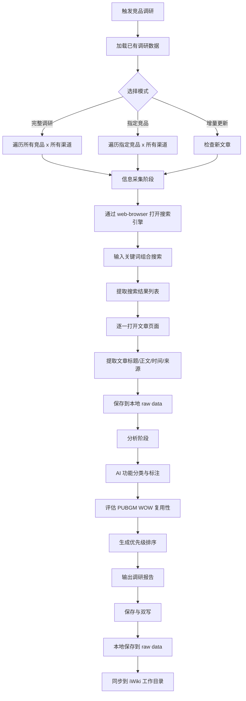
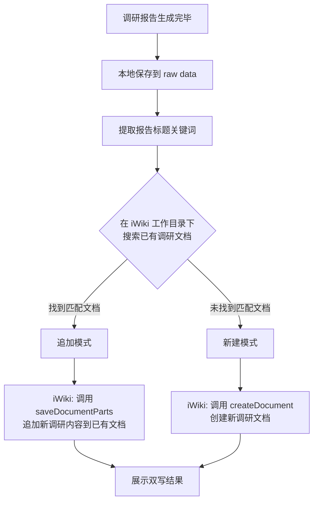

# 竞品 AI 落地调研分析

> 自动抓取游戏行业竞品的 AI 应用文章，分析 AI 落地场景，并评估在 PUBGM WOW 中的可复用性。

## 概述

本 Skill 执行两大核心任务：
1. **信息采集**：通过浏览器自动化抓取竞品的 AI 落地应用文章和资讯
2. **分析输出**：基于采集到的信息，产出面向 PUBGM WOW 的 AI 功能可行性分析报告

## 目标竞品

| 竞品 | 公司 | 重点关注方向 |
|------|------|-------------|
| Roblox | Roblox Corp | AI 辅助创作、AI NPC、AI 代码生成、AI 翻译 |
| 元梦之星 | 腾讯 | AI UGC 地图生成、AI 辅助玩法设计 |
| 蛋仔派对 | 网易 | AI 地图编辑器、AI NPC 交互、AI 内容推荐 |
| 和平精英/绿洲启元 | 腾讯 | AI Bot、AI 辅助对战、AI 语音、AI 反作弊 |

## 信息采集源

### 搜索关键词矩阵

每个竞品使用以下关键词组合进行搜索，详见 [references/search-keywords.md](references/search-keywords.md)。

### 采集渠道

| 渠道 | URL 模式 | 优先级 |
|------|---------|--------|
| Google 搜索 | `google.com/search?q={keywords}` | P0 |
| 百度搜索 | `baidu.com/s?wd={keywords}` | P0 |
| 微信公众号搜狗搜索 | `weixin.sogou.com/weixin?query={keywords}` | P1 |
| 36氪 | `36kr.com/search/articles/{keywords}` | P1 |
| 游戏行业媒体 | GameLook、游戏葡萄、触乐 | P2 |
| 技术社区 | 知乎、CSDN、掘金 | P2 |

## 执行流程

### 命令触发

| 指令 | 功能 | 参数 | 示例 |
|------|------|------|------|
| `/competitive-research` | 执行完整调研 | `[--target 竞品名]` `[--mode 模式]` | `/competitive-research` |
| `/competitive-research --target roblox` | 只调研 Roblox | 竞品可选: roblox/yuanmeng/danzai/heping | `/competitive-research --target danzai` |
| `/competitive-research --mode update` | 增量更新 | 只抓取新文章 | `/competitive-research --mode update` |
| `/competitive-research --mode analyze` | 仅分析 | 跳过抓取，分析已有数据 | `/competitive-research --mode analyze` |

### 完整流程



### Step 1: 信息采集

使用 `web-browser` 工具进行网页抓取。

**对每个竞品 × 每个关键词组合**：

1. 打开搜索引擎（Google/百度），输入关键词
2. 获取搜索结果页面快照，提取前 10 条结果的标题和链接
3. 过滤掉已采集的 URL（对照本地已有数据去重）
4. 逐一打开新文章链接，提取以下字段：
   - `title`：文章标题
   - `source`：来源网站
   - `url`：原文链接
   - `date`：发布日期
   - `content_summary`：正文摘要（前 500 字）
   - `ai_features`：提及的 AI 功能列表
   - `competitor`：关联竞品名称

5. 将采集数据保存为 JSON 格式到 `raw data/competitive_research/` 目录

**采集数据存储格式**：

```json
{
  "competitor": "roblox",
  "articles": [
    {
      "title": "Roblox 推出 AI 代码助手...",
      "source": "36kr.com",
      "url": "https://...",
      "date": "2025-12-01",
      "content_summary": "...",
      "ai_features": ["AI 代码生成", "AI NPC 对话"],
      "relevance_to_pubgm": "high",
      "crawled_at": "2026-03-06T00:00:00"
    }
  ]
}
```

### Step 2: AI 功能分类

将采集到的 AI 功能按以下维度分类，详见 [references/ai-category-framework.md](references/ai-category-framework.md)：

| 分类 | 描述 | 示例 |
|------|------|------|
| AI 辅助创作 | AI 帮助用户/开发者创建内容 | AI 地图生成、AI 代码辅助、AI 资产生成 |
| AI 智能交互 | AI 驱动的游戏内交互体验 | AI NPC 对话、AI 语音聊天、AI 表情生成 |
| AI 对战增强 | AI 提升对战体验 | AI Bot、AI 难度调节、AI 队伍匹配 |
| AI 内容推荐 | AI 驱动的个性化推荐 | AI 地图推荐、AI 玩法推荐、AI 社交推荐 |
| AI 安全治理 | AI 用于安全和治理 | AI 反作弊、AI 内容审核、AI 举报处理 |
| AI 运营效率 | AI 提升运营效率 | AI 翻译本地化、AI 客服、AI 数据分析 |

### Step 3: PUBGM WOW 可行性评估

对每个 AI 功能点，从三个维度评估：

1. **可复用性**（Reusability）：能否直接或稍加改造复用到 PUBGM WOW
   - ✅ 高：技术方案成熟，可直接借鉴
   - 🔶 中：需要一定适配，但思路可用
   - ❌ 低：场景差异大，难以复用

2. **可优化性**（Optimization）：相比竞品，PUBGM WOW 是否能做得更好
   - ✅ 有明确优化方向
   - 🔶 有潜在优化空间
   - ❌ 竞品已做到极致

3. **优先级**（Priority）：建议在 PUBGM WOW 中实施的优先级
   - P0：立即可做，ROI 高
   - P1：中期规划，需要一定投入
   - P2：长期探索，技术或资源门槛高

### Step 4: 生成调研报告

输出格式为 Markdown，包含以下章节：

```markdown
# 竞品 AI 落地调研报告
> 生成时间：{timestamp}
> 覆盖竞品：Roblox、元梦之星、蛋仔派对、和平精英/绿洲启元

## 一、执行摘要
{核心发现 3-5 条}

## 二、各竞品 AI 落地全景
### 2.1 Roblox
{AI 功能列表 + 来源文章引用}
### 2.2 元梦之星
...
### 2.3 蛋仔派对
...
### 2.4 和平精英/绿洲启元
...

## 三、AI 功能分类汇总
{按 6 大分类汇总所有竞品的 AI 功能}

## 四、PUBGM WOW 机会分析
### 4.1 可直接复用的功能（P0）
{功能点 + 竞品参考 + 实施建议}
### 4.2 可优化借鉴的功能（P1）
{功能点 + 优化方向 + 差异化思路}
### 4.3 前瞻探索方向（P2）
{功能点 + 技术挑战 + 长期价值}

## 五、推荐行动计划
{按时间线排列的实施建议}

## 附录：采集文章索引
{所有采集文章的标题、来源、链接列表}
```

### Step 5: 保存与双写（本地 + iWiki）

调研报告生成后，**强制双写**到本地文件和 iWiki 工作目录，流程参考 `note-sync` Skill。

#### 5.1 本地保存

报告保存到 `raw data/competitive_research/reports/` 目录：
- 文件名格式：`competitive_research_report_{YYYY-MM-DD}.md`
- 采集的原始文章数据保存到 `raw data/competitive_research/articles/` 目录

#### 5.2 iWiki 双写

##### iWiki 配置

| 配置项 | 值 | 说明 |
|--------|-----|------|
| 个人空间 ID（spaceid） | 4010703137 | 用户 iWiki 个人空间 |
| 工作目录 ID（parentid） | 4018520220 | 知识库 > 我的笔记 > 工作 |

##### 双写流程



##### 新建模式

当 iWiki 工作目录下没有相关调研文档时，创建新文档：

```
createDocument:
  spaceid: 4010703137
  parentid: 4018520220
  title: "竞品AI落地调研报告-{YYYY-MM-DD}"
  contenttype: "MD"
  body: {完整报告 Markdown 正文}
```

##### 追加模式

当已有相关调研文档时（如上次调研的报告），追加更新内容：

```
saveDocumentParts:
  id: {已有文档的 docid}
  title: 保持原标题
  after: |
    
    ---
    
    ## 增量更新 (YYYY-MM-DD HH:MM)
    
    {新增调研内容}
```

**匹配规则**：
1. 调用 `getSpacePageTree` 获取工作目录（4018520220）下的子文档列表
2. 标题包含"竞品AI"或"竞品调研"的文档视为匹配
3. 如有多个匹配，选择最近更新的文档进行追加

##### 双写结果输出格式

**新建模式**：
```
📝 竞品调研报告已双写保存（新建）：

**本地** → `raw data/competitive_research/reports/competitive_research_report_{日期}.md`
**iWiki** → 知识库 > 我的笔记 > 工作 > 竞品AI落地调研报告-{日期} (docid: {id})

---
> {报告执行摘要预览...}
```

**追加模式**：
```
📝 竞品调研报告已追加到已有文档：

**本地** → `raw data/competitive_research/reports/competitive_research_report_{日期}.md` (新建)
**iWiki** → 知识库 > 我的笔记 > 工作 > {已有文档标题} (docid: {id}, 已追加)

---
> {新增调研内容预览...}
```

##### iWiki 同步失败处理

如果 iWiki 操作失败（网络问题等），本地文件仍然保存成功，向用户提示 iWiki 同步失败并提供 Markdown 文本供手动发布。

## 注意事项

1. **采集频率控制**：每次搜索间隔 2-3 秒，避免被搜索引擎限流
2. **中英文搜索**：Roblox 相关内容同时搜索中英文关键词
3. **时效性过滤**：优先采集近 6 个月内的文章
4. **去重机制**：基于 URL 去重，避免重复采集相同文章
5. **代理配置**：如需访问 Google，参考 `config.yaml` 中的 proxy 配置
6. **增量更新**：每次调研保存采集记录，下次调研时跳过已采集的 URL
7. **web-browser 使用**：搜索和抓取全部通过 `web-browser` 命令行工具执行，参考 web-browser Skill 文档
