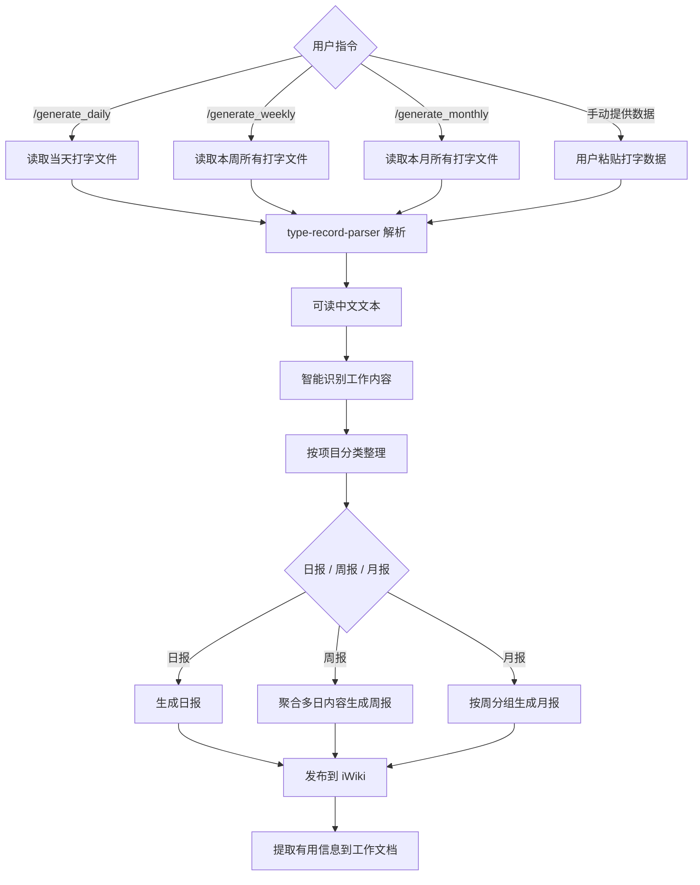

# 日报/周报/月报智能生成 Skill

> 从凌乱的打字数据中自动提取工作内容，按项目分类整理，生成日报/周报/月报并发布到 iWiki。

## 概述

本 Skill 帮助用户高效完成日报/周报/月报的生成与管理：
- 🧠 **智能识别**：从打字数据中识别工作相关内容，过滤噪音
- 📂 **项目分类**：按项目/模块自动分类工作条目
- 📝 **日报生成**：生成格式化日报并发布到 iWiki
- 📊 **周报汇总**：自动聚合一周日报，生成周报
- 📅 **月报汇总**：自动聚合一个月的日报/周报，生成月报
- 📌 **知识沉淀**：提取有价值信息，整理到工作文档

## 数据源配置

### 打字数据存放位置

打字数据统一存放在项目工作区的 `raw data/type_record/` 目录下：

```
raw data/type_record/
├── keyboard_2026-03-01.txt
├── keyboard_2026-03-02.txt
├── keyboard_2026-03-03.txt
├── keyboard_2026-03-04.txt
├── keyboard_2026-03-05.txt
└── ...
```

**文件命名规则**：`keyboard_YYYY-MM-DD.txt`
- `YYYY`：4位年份
- `MM`：2位月份（补零）
- `DD`：2位日期（补零）

### 数据读取规则

根据不同指令，自动读取对应日期范围的文件：

| 指令 | 读取范围 | 文件选择逻辑 |
|------|---------|-------------|
| `/generate_daily` | 当天 | 读取 `keyboard_YYYY-MM-DD.txt`（默认今天，可指定日期） |
| `/generate_weekly` | 本周 | 读取本周一~本周日所有文件（默认本周，可指定周次） |
| `/generate_monthly` | 本月 | 读取本月1日~本月末所有文件（默认本月，可指定月份） |

**缺失文件处理**：如果某天的文件不存在，跳过该天并在报告中标注"无数据"。

## 前置依赖

本 Skill 依赖 `type-record-parser` Skill 作为数据预处理器：
- 当用户提供的是**原始键盘打字记录**（含 `[拼音:xxx][选字:N]` 格式）时，需先调用 `type-record-parser` 将其转换为可读中文文本
- 当用户提供的是**已经可读的文字内容**时，可直接进入本 Skill 的工作流

## 快捷指令

### `/generate_daily` — 生成日报

**触发方式**：用户输入 `/generate_daily` 或 `/generate_daily YYYY-MM-DD`

**执行流程**：


**参数说明**：

| 参数 | 格式 | 默认值 | 说明 |
|------|------|--------|------|
| 日期 | `YYYY-MM-DD` | 当天（系统时间） | 指定要生成日报的日期 |

**使用示例**：
```
/generate_daily              → 生成今天的日报
/generate_daily 2026-03-04   → 生成2026年3月4日的日报
```

**详细步骤**：
1. **确定目标日期**：无参数则使用当天日期，有参数则使用指定日期
2. **定位数据文件**：在 `raw data/type_record/` 目录下查找 `keyboard_{日期}.txt`
3. **读取文件内容**：使用 `read_file` 工具读取完整文件内容
4. **解析打字数据**：调用 `type-record-parser` Skill 将原始操作序列还原为可读中文
5. **识别工作内容**：从还原后的文字中智能识别工作相关内容（参见下方"智能识别"章节）
6. **按项目分类**：将工作内容归类到对应项目（参见下方"项目分类"章节）
7. **生成日报**：使用日报模板生成格式化文档
8. **用户确认**：展示日报预览，等待用户确认或修改
9. **发布到 iWiki**：确认后发布

---

### `/generate_weekly` — 生成周报

**触发方式**：用户输入 `/generate_weekly` 或 `/generate_weekly YYYY-WNN`

**执行流程**：


**参数说明**：

| 参数 | 格式 | 默认值 | 说明 |
|------|------|--------|------|
| 周次 | `YYYY-WNN` | 当前周 | 指定年份和第几周（ISO周） |
| 日期范围 | `YYYY-MM-DD~YYYY-MM-DD` | - | 也可直接指定起止日期 |

**使用示例**：
```
/generate_weekly                        → 生成本周的周报
/generate_weekly 2026-W10               → 生成2026年第10周的周报
/generate_weekly 2026-03-03~2026-03-07  → 生成3月3日到3月7日的周报
```

**详细步骤**：
1. **确定日期范围**：
   - 无参数：计算本周一到今天（或本周日）的日期范围
   - `YYYY-WNN`：根据ISO周计算该周一到周日的日期范围
   - `起始~结束`：使用指定的日期范围
2. **批量读取文件**：遍历日期范围内的所有 `keyboard_{日期}.txt` 文件
3. **逐日解析**：对每个文件调用 `type-record-parser` 解析
4. **合并工作内容**：汇总所有日期的工作内容，去重和合并同一工作项的不同天记录
5. **智能汇总**：
   - 合并重复内容，提炼核心进展
   - 识别跨天的持续性工作，标记进度变化
   - 提取本周完成的里程碑和关键成果
6. **生成周报**：使用周报模板生成格式化文档（含进度表格）
7. **用户确认**：展示周报预览，等待用户确认或修改
8. **发布到 iWiki**：确认后发布

---

### `/generate_monthly` — 生成月报

**触发方式**：用户输入 `/generate_monthly` 或 `/generate_monthly YYYY-MM`

**执行流程**：


**参数说明**：

| 参数 | 格式 | 默认值 | 说明 |
|------|------|--------|------|
| 月份 | `YYYY-MM` | 当前月 | 指定年月 |

**使用示例**：
```
/generate_monthly           → 生成本月的月报
/generate_monthly 2026-02   → 生成2026年2月的月报
```

**详细步骤**：
1. **确定日期范围**：
   - 无参数：本月1日到今天
   - `YYYY-MM`：该月1日到该月最后一天
2. **批量读取文件**：遍历该月所有 `keyboard_{日期}.txt` 文件
3. **逐日解析**：对每个文件调用 `type-record-parser` 解析
4. **按周分组**：将一个月的工作内容按自然周分组
5. **深度汇总**：
   - 按项目维度：汇总各项目本月整体进展和完成情况
   - 按时间维度：按周展示工作节奏和重点变化
   - 提取月度关键成果、里程碑和数据指标
   - 识别本月的主要问题和风险
6. **生成月报**：使用月报模板生成格式化文档
7. **用户确认**：展示月报预览，等待用户确认或修改
8. **发布到 iWiki**：确认后发布

**月报模板**：

```markdown
# 月报 - YYYY年MM月

## 本月概要
简要总结本月整体工作进展（3-5句话），包括重点项目、关键成果、主要挑战。

## 工作进展

### 【项目A】

**整体进度**：XX% → YY%（本月推进 ZZ%）

#### 第1周 (MM/DD - MM/DD)
| 工作内容 | 状态 | 备注 |
|---------|------|------|
| 功能开发XXX | 已完成 | - |

#### 第2周 (MM/DD - MM/DD)
| 工作内容 | 状态 | 备注 |
|---------|------|------|
| 联调测试XXX | 已完成 | - |

#### 第3周 (MM/DD - MM/DD)
...

#### 第4周 (MM/DD - MM/DD)
...

### 【项目B】
（同上格式）

## 关键成果
- 🎯 成果1：具体描述
- 🎯 成果2：具体描述

## 问题与风险
| 问题 | 影响 | 状态 | 解决方案 |
|------|------|------|----------|
| 问题描述 | 影响范围 | 已解决/跟进中 | 方案描述 |

## 数据指标（如适用）
| 指标 | 月初 | 月末 | 变化 |
|------|------|------|------|
| 指标名 | 数值 | 数值 | +/-变化 |

## 下月计划
- 计划1：具体描述
- 计划2：具体描述

## 个人成长与反思
- 本月学到的新技能或知识
- 需要改进的地方
```

---

## 工作流

### 流程概览



### 第一步：智能识别工作内容

收到用户的打字数据后，执行以下分析：

1. **过滤非工作内容**：排除闲聊、娱乐、无意义片段（如表情符号、纯口语化闲聊、与工作无关的话题）
2. **识别工作关键词**：匹配项目名、技术术语、任务描述、会议关键词、Bug/需求编号等
3. **上下文推断**：结合用户已知的工作内容和项目背景，推断模糊内容是否与工作相关
4. **时间线还原**：根据数据顺序和时间标记，还原工作时间线

**识别规则：**
- 包含技术术语、代码片段、接口名称 → 大概率工作相关
- 包含项目名、产品名、同事名 → 大概率工作相关
- 包含"需求"、"Bug"、"上线"、"评审"、"联调"等关键词 → 工作相关
- 包含会议纪要、讨论内容 → 工作相关
- 纯闲聊、段子、购物、游戏等 → 非工作内容

### 第二步：按项目分类

将识别出的工作内容按项目/模块进行分类：

1. **自动分类**：根据关键词和上下文，将工作条目归类到对应项目
2. **未知分类**：无法确定项目归属的条目，归入"其他"或请求用户确认
3. **分类结构**：
   ```
   项目A
   ├── 子模块1: 工作内容描述
   └── 子模块2: 工作内容描述
   项目B
   ├── 工作内容描述
   └── 工作内容描述
   ```

### 第三步：生成日报

使用以下模板生成日报。模板是默认格式，可根据用户偏好调整：

```markdown
# 日报 - YYYY年MM月DD日

## 今日工作

### 【项目A】
- [完成] 具体工作内容描述
- [进行中] 具体工作内容描述
- [计划] 具体工作内容描述

### 【项目B】
- [完成] 具体工作内容描述
- [进行中] 具体工作内容描述

## 问题与风险
- 问题描述及当前状态

## 明日计划
- 计划工作内容（从打字数据中提取"明天"、"计划"、"下一步"等关键词对应内容）

## 备注
- 其他有价值的信息
```

**工作状态标记规则：**
- `[完成]`：包含"完成"、"搞定"、"已解决"、"提交"、"合入"等词汇
- `[进行中]`：包含"在做"、"调试中"、"联调中"、"开发中"等词汇
- `[计划]`：包含"明天"、"计划"、"准备"、"下一步"等词汇

### 第四步：生成周报

周报模式下，自动聚合本周（周一~周五/周日）的日报内容：

1. **数据来源**：从 iWiki 获取本周已发布的日报，或从用户提供的多天数据中提取
2. **智能汇总**：合并重复内容，提炼核心进展
3. **周报模板**：

```markdown
# 周报 - YYYY年MM月DD日 ~ MM月DD日

## 本周概要
简要总结本周整体工作进展（2-3句话）

## 工作进展

### 【项目A】
| 工作内容 | 状态 | 进度 | 备注 |
|---------|------|------|------|
| 功能开发XXX | 已完成 | 100% | 已合入主干 |
| Bug修复XXX | 进行中 | 70% | 待测试验证 |

### 【项目B】
| 工作内容 | 状态 | 进度 | 备注 |
|---------|------|------|------|
| 需求评审XXX | 已完成 | 100% | - |

## 问题与风险
- 问题描述、影响范围、当前状态

## 下周计划
- 计划工作内容

## 关键成果/亮点
- 本周值得highlight的成果
```

### 第五步：发布到 iWiki

使用 iWiki MCP 工具发布报告：

1. **确定发布位置**：
   - 需要用户首次使用时提供 iWiki 空间ID（spaceid）和父目录ID（parentid）
   - 记录后续复用

2. **发布日报**：分两步创建（避免 JSON 渲染问题）
   - **第一步**：使用 `createDocument` 创建空文档
     ```
     spaceid: 用户空间ID
     parentid: 日报目录ID
     title: "日报 - YYYY年MM月DD日"
     body: " "
     contenttype: "MD"
     ```
   - **第二步**：使用 `saveDocument` 写入正文内容
     ```
     docid: 上一步返回的文档ID
     title: "日报 - YYYY年MM月DD日"
     body: 日报Markdown内容
     ```

3. **发布周报**：分两步创建（同上）
   - **第一步**：使用 `createDocument` 创建空文档
     ```
     spaceid: 用户空间ID
     parentid: 周报目录ID
     title: "周报 - YYYY.MM.DD ~ MM.DD"
     body: " "
     contenttype: "MD"
     ```
   - **第二步**：使用 `saveDocument` 写入正文内容
     ```
     docid: 上一步返回的文档ID
     title: "周报 - YYYY.MM.DD ~ MM.DD"
     body: 周报Markdown内容
     ```

4. **发布月报**：分两步创建（同上）
   - **第一步**：使用 `createDocument` 创建空文档
     ```
     spaceid: 用户空间ID
     parentid: 月报目录ID
     title: "月报 - YYYY年MM月"
     body: " "
     contenttype: "MD"
     ```
   - **第二步**：使用 `saveDocument` 写入正文内容
     ```
     docid: 上一步返回的文档ID
     title: "月报 - YYYY年MM月"
     body: 月报Markdown内容
     ```

5. **更新已有文档**：如果当天日报已存在，使用 `saveDocument` 更新

> ⚠️ **重要**：创建带内容的新文档时，**禁止**在 `createDocument` 的 `body` 中直接传入正文内容。必须先创建空文档，再用 `saveDocument` 写入内容。这是因为 `createDocument` 直接传入 body 可能导致 iWiki 将内容以 JSON ProseMirror 结构存储为纯文本，在页面上显示为 JSON 字符串而非格式化的 Markdown。

### 第六步：提取有用信息到工作文档

在生成日报/周报的同时，识别并提取有价值的信息：

1. **技术决策**：讨论中达成的技术方案决定
2. **会议结论**：会议讨论的结论和待办
3. **问题记录**：遇到的问题和解决方案
4. **知识点**：有价值的技术知识点

使用 `saveDocumentParts` 将这些信息追加到用户指定的工作文档中（只在用户明确要求时执行）。

## 使用方式

### 场景1：快捷指令生成日报（推荐）

```
用户：/generate_daily
```
自动读取今天的 `keyboard_2026-03-05.txt` → 解析 → 识别 → 分类 → 生成日报 → 确认后发布

```
用户：/generate_daily 2026-03-04
```
自动读取指定日期的打字数据 → 同上流程

### 场景2：快捷指令生成周报（推荐）

```
用户：/generate_weekly
```
自动读取本周所有打字数据 → 逐日解析 → 汇总 → 生成周报 → 确认后发布

```
用户：/generate_weekly 2026-03-03~2026-03-07
```
读取指定日期范围的数据 → 同上流程

### 场景3：快捷指令生成月报（推荐）

```
用户：/generate_monthly
```
自动读取本月所有打字数据 → 逐日解析 → 按周分组 → 生成月报 → 确认后发布

```
用户：/generate_monthly 2026-02
```
读取指定月份的所有数据 → 同上流程

### 场景4：手动提供数据生成日报

```
用户：今天的打字数据如下：
[粘贴打字数据]
```

执行流程：解析 → 识别内容 → 分类 → 生成日报 → 确认后发布

### 场景5：补充更新

```
用户：今天下午又做了一些事情：[补充数据]
```

执行流程：识别新内容 → 合并到今日日报 → 更新 iWiki 文档

## 交互规范

### 首次使用

首次使用时，需要向用户获取以下配置：
1. **iWiki 空间ID**（spaceid）：日报/周报发布到哪个空间
2. **日报父目录ID**（parentid）：日报存放的目录
3. **周报父目录ID**（parentid）：周报存放的目录（可与日报相同）
4. **月报父目录ID**（parentid）：月报存放的目录（可与日报/周报相同）
5. **工作文档ID**（可选）：有用信息整理到哪个文档

获取后建议使用 `update_memory` 持久化这些配置，后续自动复用。

### 确认机制

- 生成日报/周报后，先展示给用户预览
- 用户确认后再发布到 iWiki
- 用户可以要求修改内容后再发布

### 错误处理

| 场景 | 处理方式 |
|------|---------|
| 打字数据全是闲聊 | 告知用户未识别到工作内容，请补充 |
| 无法确定项目归属 | 列出未分类内容，请用户指定 |
| iWiki 发布失败 | 展示错误信息，提供 Markdown 文本供手动发布 |
| 找不到已有日报 | 创建新文档而非更新 |

## 指令速查表

| 指令 | 功能 | 参数 | 示例 |
|------|------|------|------|
| `/generate_daily` | 生成日报 | `[YYYY-MM-DD]`（可选） | `/generate_daily` 或 `/generate_daily 2026-03-04` |
| `/generate_weekly` | 生成周报 | `[YYYY-WNN]` 或 `[起始~结束]`（可选） | `/generate_weekly` 或 `/generate_weekly 2026-W10` |
| `/generate_monthly` | 生成月报 | `[YYYY-MM]`（可选） | `/generate_monthly` 或 `/generate_monthly 2026-02` |

## 参考

- iWiki 操作详情参考 `iwiki-doc` Skill
- 打字数据解析详情参考 `type-record-parser` Skill
