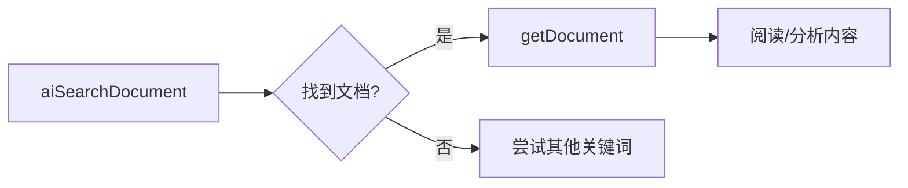
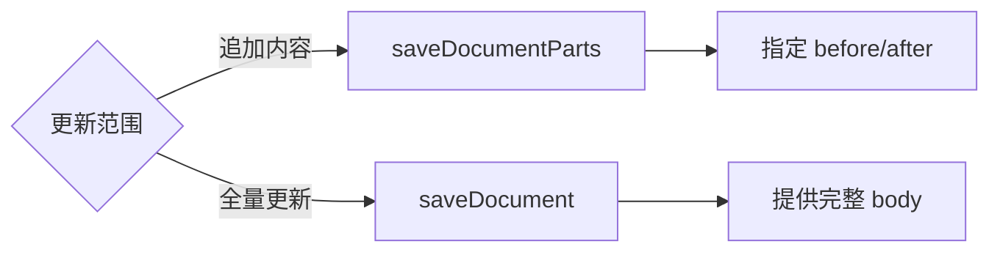
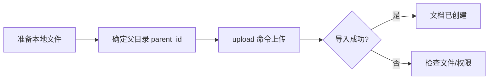
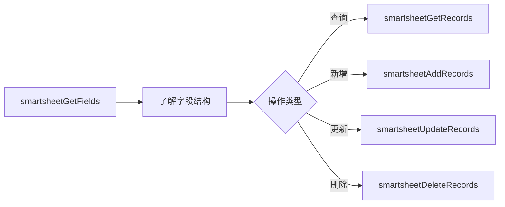

# iWiki Skill

> iWiki MCP 是一个用于与 iWiki 文档系统交互的 Model Context Protocol 服务，提供文档管理、搜索、创建、编辑和多维表格操作能力。

## 概述

本 Skill 帮助你高效使用 iWiki MCP 工具进行文档操作，包括：
- 📖 **文档搜索与阅读**：搜索、获取文档内容和元数据
- ✍️ **文档创建与编辑**：创建、保存、局部更新文档
- 🏷️ **标签管理**：添加、删除、查询文档标签
- 📊 **多维表格操作**：操作 Smartsheet 字段、视图和记录
- 💬 **评论互动**：获取、添加文档评论

## 快速开始

### 0. 连接 MCP Server

在使用 iWiki MCP 功能之前，需要先连接 MCP Server。

#### 使用 Python 脚本连接（推荐）

1. 安装依赖：
```bash
pip install requests
```

2. 设置环境变量：
```bash
export TAI_PAT_TOKEN="your_tai_pat_token_here"
```

3. 运行连接脚本验证：
```bash
# 仅验证连接
python scripts/connect_mcp.py

# 验证连接并获取文档
python scripts/connect_mcp.py call getDocument '{"docid": "4017403457"}'
```

脚本会：
- 发送 `initialize` 请求验证 MCP 连接
- 获取 `tools/list` 显示所有可用工具
- （可选）调用 `getDocument` 获取指定文档

#### 认证方式

所有请求需要在 Header 中携带 Bearer Token：
```
Authorization: Bearer TAI_PAT_TOKEN
```

### 0.5 导入文档（无需连接 MCP Server）

文件导入功能通过独立的 HTTP 端点 `POST /import` 实现，**不需要先连接 MCP Server**（无需 `initialize` 和 `tools/list` 步骤），可直接调用。

#### 支持的文件类型
- Markdown 文件（`.md`）
- Word 文档（`.docx`）
- 包含.md 和.docx 的 zip 压缩包(支持包含附件)

#### 使用限制
- 文件大小不超过 **50MB**
- 不支持导入到需要审批的文档目录
- 默认覆盖同名文档

#### 命令行导入
```bash
# 1. 设置环境变量
export TAI_PAT_TOKEN="your_tai_pat_token_here"

# 2. 上传 Markdown 文件到指定父目录
python scripts/connect_mcp.py upload ./doc.md 4017403457

# 指定任务类型
python scripts/connect_mcp.py upload ./doc.docx 4017403457 --task-type md_import

# 不覆盖同名文档
python scripts/connect_mcp.py upload ./doc.md 4017403457 --no-cover
```

#### Python 代码调用
```python
from scripts.connect_mcp import MCPClient

client = MCPClient(token="your_tai_pat_token")
result = client.upload_file(
    file_path="./doc.md",
    parent_id=4017403457,
    task_type="md_import",  # 导入任务类型，默认 md_import
    cover=True,             # 是否覆盖同名文档，默认 True
)
print(result)  # {"success": True, "msg": "导入成功", "data": [...]}
```

#### 导入参数说明

| 参数 | 类型 | 必填 | 描述 |
|------|------|------|------|
| file_path | string | ✅ | 本地文件路径 |
| parent_id | number | ✅ | 父文档/目录 ID，文件将导入到该目录下 |
| task_type | string | ❌ | 导入任务类型，默认 `md_import` |
| cover | boolean | ❌ | 是否覆盖同名文档，默认 `true` |

#### 内部流程
导入操作在服务端自动完成以下步骤：
1. 获取预签名 URL
2. 上传文件到 COS 对象存储
3. 启动导入任务
4. 轮询等待导入完成（最多 180 秒）

### 1. 查找文档
使用 `searchDocument` 进行传统关键词搜索（支持更多筛选条件）
或
在传统搜索无结果、查询词为句子时使用 `aiSearchDocument` 进行 AI 语义搜索（推荐）：
```
搜索关键词: "项目需求文档"
限制数量: 10
```

### 2. 读取文档

获取到 docid 后，使用 `getDocument` 获取完整内容：
```
docid: "123456"
```

### 3. 创建文档

使用 `createDocument` 创建新文档：
```
spaceid: 12345        # 空间ID
parentid: 67890       # 父文档ID
title: "新文档标题"
body: "文档内容..."
contenttype: "MD"     # MD/DOC/FOLDER
```

## 核心工具列表

### 🔍 搜索类工具

| 工具名 | 用途 | 何时使用 |
|--------|------|----------|
| `searchDocument` | 传统关键词搜索 | **首选**，需要按空间/标签/作者筛选时 |
| `aiSearchDocument` | AI 语义搜索 | 当需要查找文档内容时 |
| `glossaryTermSearch` | 词条搜索 | 搜索词库中的术语定义 |

### 📄 文档读取工具

| 工具名 | 用途 | 何时使用 |
|--------|------|----------|
| `getDocument` | 获取完整内容 | 需要阅读/分析文档时 |
| `metadata` | 获取元数据 | 需要了解作者/时间等信息时 |
| `getSpacePageTree` | 获取目录树 | 需要浏览文档结构时 |
| `listImages` | 获取图片列表 | 需要提取文档中的图片 |
| `getAttachmentDownloadUrl` | 获取附件链接 | 下载附件或图片时 |

### ✏️ 文档写入工具

| 工具名 | 用途 | 何时使用 |
|--------|------|----------|
| `createDocument` | 创建文档 | 需要新建文档时 |
| `saveDocument` | 完整保存 | **推荐**，更新整个文档内容时 |
| `saveDocumentParts` | 局部更新 | 在文档头/尾追加内容时,只在用户明确的时候使用 |
| `moveDocument` | 移动文档 | 调整文档位置时 |

### 🏷️ 标签工具

| 工具名 | 用途 |
|--------|------|
| `getDocumentTags` | 获取文档标签 |
| `addDocumentTags` | 批量添加标签 |
| `deleteDocumentTag` | 删除单个标签 |

### 💬 评论工具

| 工具名 | 用途 |
|--------|------|
| `getComments` | 获取评论（支持分页） |
| `addComment` | 添加评论/回复 |

### 📊 多维表格（Smartsheet）工具

| 工具名 | 用途 |
|--------|------|
| `smartsheetGetFields` | 获取表格字段结构 |
| `smartsheetAddField` | 添加新字段 |
| `smartsheetDeleteField` | 删除字段 |
| `smartsheetGetViews` | 获取视图列表 |
| `smartsheetGetRecords` | 查询记录（支持筛选/排序） |
| `smartsheetAddRecords` | 批量添加记录 |
| `smartsheetUpdateRecords` | 批量更新记录 |
| `smartsheetDeleteRecords` | 批量删除记录 |

### 📥 文档导入工具

| 工具名 | 用途 | 何时使用 |
|--------|------|----------|
| `upload`（命令行） | 上传文件导入到 iWiki | 需要将本地文件导入为 iWiki 文档时，**无需连接 MCP Server** |

### 🏠 空间管理工具

| 工具名 | 用途 |
|--------|------|
| `getSpaceInfoByKey` | 根据 Key 查询空间 |
| `getSpaceInfoByName` | 根据名称查询空间 |
| `getFavoriteSpaces` | 获取收藏的空间 |
| `getManageSpaces` | 获取管理的空间 |

## 使用规范

### ⚠️ 重要约定

1. **搜索优先**
   - 当问题是”某个词是什么意思时“，优先使用 `glossaryTermSearch`
   - 首先使用 `searchDocument` 或  `aiSearchDocument` 找到目标文档
   - 获取 docid 后再进行其他操作

2. **确认空间 ID**
   - 创建文档前必须确认 `spaceid` 和 `parentid`
   - 使用 `getSpaceInfoByKey` 或 `getSpaceInfoByName` 获取空间信息

3. **内容非空检查**
   - `createDocument` 和 `saveDocument` 的 body 参数**不能为空**
   - MCP 服务会拒绝空内容的写入

4. **审批文档限制**
   - 需要审批的文档**不支持**创建/更新/移动
   - 操作前会自动检查，如遇到审批文档会返回提示

5. **更新删除约定**
   - 追加内容时优先使用 `saveDocumentParts`（在头部/尾部追加）
   - 全量更新使用 `saveDocument`
   - 所有的高危操作(如：`deleteDocumentTag`, `moveDocument`, `smartsheetDeleteField`,`smartsheetDeleteRecords`,)都需要用户二次确认

6. **内容格式**
    - 创建文档时内容格式优先使用 Markdown格式，指定DOC时使用XHTML格式，bodymode指定为`html`
    - 更新文档时先使用`metadata`判断文档类型，如果是Markdown，则使用Markdown格式，如果是DOC，则使用XHTML格式
    - 添加评论时内容时，使用XHTML格式
    - XHTML基本元素：，-, , , , , ,<p><h1><h6><strong><em><code><ul><ol><li>，表格：/ 结构<table><tbody><tr><th><td>，内容一定要用合适的XHTML标签包装

7. **文件限制**
    - 在创建、更新等使用场景下，先创建临时文本文件，然后执行完成后，再删除掉这个临时文本文件
    - 在同步一个仓库的md到iWiki时，先找出md里包含的附件，并将附件与md一起打包成临时的zip文件，然后再导入操作

### 📝 URL 格式说明

| URL 类型 | 示例 | 说明 |
|----------|------|------|
| 个人空间 | `https://iwiki.woa.com/space/~myname` | Key 为 `~myname` |
| 普通空间 | `https://iwiki.woa.com/space/devcloud` | Key 为 `devcloud` |
| 文档页面 | `https://iwiki.woa.com/p/123456` | docid 为 `123456` |
| 专题 | `https://iwiki.woa.com/topic/1232323` | topic_id 为 `1232323` |

### 📊 多维表格操作流程

1. **了解表格结构**
   ```
   smartsheetGetFields(doc_id) -> 获取所有字段定义
   smartsheetGetViews(doc_id) -> 获取视图列表
   ```

2. **查询数据**
   ```
   smartsheetGetRecords(doc_id, {
     pageNum: 1,
     pageSize: 100,
     filterByFormula: "条件表达式",
     fields: "字段1,字段2"
   })
   ```

3. **写入数据**
   ```
   smartsheetAddRecords(doc_id, fieldKey: "name", records: [
     { fields: { "字段名": "值" } }
   ])
   ```

### 支持的字段类型

```
SingleText, Text, SingleSelect, MultiSelect, Number, Currency,
Percent, DateTime, Attachment, Member, Checkbox, Rating, URL,
Phone, Email, WorkDoc, OneWayLink, TwoWayLink, MagicLookUp,
Formula, AutoNumber, CreatedTime, LastModifiedTime, CreatedBy,
LastModifiedBy, Button
```

### 支持的视图类型

```
Grid（表格）, Gallery（画廊）, Kanban（看板）,
Gantt（甘特图）, Calendar（日历）, Architecture（架构）
```

## 常见场景

### 场景 1：搜索并阅读文档



### 场景 2：创建新文档


### 场景 3：更新文档



### 场景 4：导入本地文件（无需连接 MCP）



### 场景 5：操作多维表格



## 错误处理

| 错误信息 | 原因 | 解决方案 |
|----------|------|----------|
| `body 为空值` | 内容参数为空 | 确保传入有效的文档内容 |
| `MCP不支持审批流程` | 文档需要审批 | 手动在 iWiki 网页操作 |

## 参考资料

- [API 参考文档](./references/api_reference.md)
