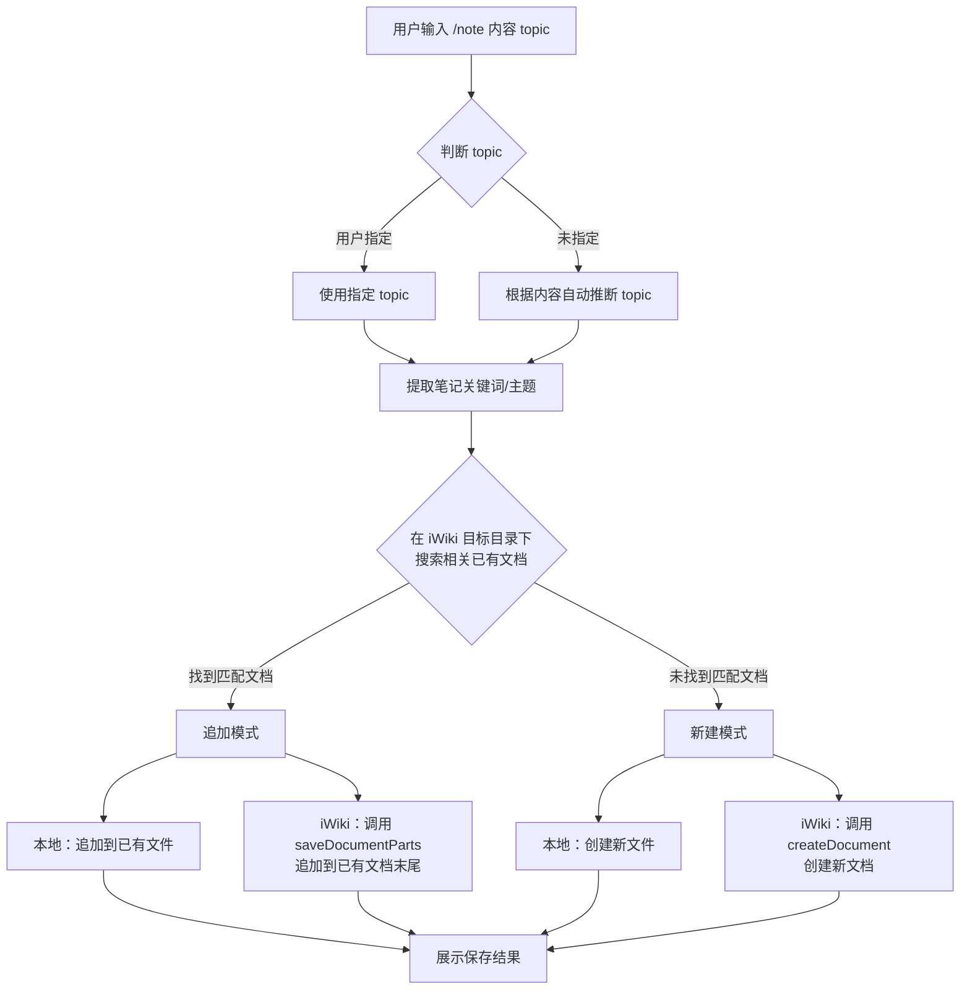

# 笔记双写同步 Skill

> 每次记录笔记时，自动保存两份：一份在本地 `data/context/__created/`，一份同步到 iWiki 知识库。
> **智能匹配**：优先追加到已有的相关文档，找不到才创建新文档。

## 概述

本 Skill 确保用户的每一条笔记都在两个地方保留副本：
- 📁 **本地文件**：通过 `add_note` MCP 工具保存到 `data/context/__created/{topic}/` 目录
- 🌐 **iWiki 文档**：通过 iWiki MCP 工具同步到 iWiki 个人空间的「知识库」目录

### 核心原则：智能去重

**不是每条笔记都创建新文档**，而是：
1. 先根据笔记内容关键词，在对应 iWiki 目录下搜索是否有**主题相关的已有文档**
2. 如果找到匹配的文档 → **追加内容**到已有文档末尾
3. 如果找不到匹配文档 → **创建新文档**

## iWiki 配置

### 空间信息
- **个人空间 ID**：4010703137
- **空间首页 ID**：4010703139

### 目录结构与 ID 映射

```
知识库 (4018520205)
├── 我的笔记 (4018520209)    ← 对应本地 __created/
│   ├── 个人 (4018520218)    ← topic: personal, writing, preferences, reflection, ideas
│   └── 工作 (4018520220)    ← topic: work, tasks, product
├── 收集整理 (4018520212)    ← 对应本地 __collected/
│   ├── 文章 (4018520223)
│   │   ├── AI (4018520230)  ← topic: ai
│   │   └── 阅读 (4018520231) ← topic: reading
│   ├── GitHub (4018520226)
│   │   ├── AI (4018520233)
│   │   └── 阅读 (4018520235)
│   └── RSS (4018520228)
│       ├── AI (4018520238)
│       └── 阅读 (4018520239)
```

### Topic 到 iWiki 文件夹 ID 映射

| topic | iWiki 文件夹名称 | 文件夹 ID |
|-------|-----------------|-----------|
| personal | 个人 | 4018520218 |
| writing | 个人 | 4018520218 |
| preferences | 个人 | 4018520218 |
| reflection | 个人 | 4018520218 |
| ideas | 个人 | 4018520218 |
| work | 工作 | 4018520220 |
| tasks | 工作 | 4018520220 |
| product | 工作 | 4018520220 |
| ai | 文章/AI | 4018520230 |
| reading | 文章/阅读 | 4018520231 |

> 如果 topic 不在上表中，默认使用「个人」文件夹 (4018520218)。

## 执行流程

### `/note` 命令处理流程



### 执行步骤详解

#### Step 1: 判断主题
- 如果用户指定了 topic，直接使用
- 如果未指定，根据内容关键词自动推断最合适的主题
- 可选值：personal / writing / tasks / preferences / reflection / product / work / reading / ideas / ai

#### Step 2: 提取关键词，搜索已有文档

从笔记内容中提取核心关键词（通常是第一行标题、核心实体名词），然后在 iWiki **对应 topic 的目录下**搜索是否存在相关文档。

**搜索策略**：
1. **优先通过目录树匹配**：调用 `getSpacePageTree` 获取 topic 对应 iWiki 文件夹下的所有子文档列表，通过标题关键词进行匹配
2. **辅助语义搜索**：如果目录树匹配不到，调用 `aiSearchDocument` 在对应文件夹范围内搜索

**匹配规则**（按优先级从高到低）：
1. **标题精确匹配**：新笔记的标题/关键主题词与已有文档标题完全一致 → 直接追加
2. **标题包含匹配**：已有文档标题包含新笔记的核心关键词（如"半开放平台"出现在已有文档标题中）→ 追加
3. **内容主题一致**：通过 `aiSearchDocument` 搜索到内容主题高度相关的文档 → 追加
4. **无匹配** → 创建新文档

**重要判断原则**：
- 匹配的核心是判断新笔记和已有文档是否讨论**同一个事项/主题**
- 例如："半开放平台需要确认事项补充"和"半开放平台相关事项梳理"属于同一主题 → 应追加
- 例如："UGC玩法开发讨论会总结"和"半开放平台相关事项梳理"虽然都是工作，但属于不同事项 → 不应追加

#### Step 3A: 追加模式（找到匹配文档）

**本地文件追加**：
- 调用 `add_note` MCP 工具，附加参数 `append_to` 指定追加到已有文件路径
- 如果 `add_note` 不支持追加参数，则直接使用 `read_file` 读取已有文件，在末尾追加新内容后 `replace_in_file` 写回

**iWiki 文档追加**：
- 调用 iWiki `saveDocumentParts` 工具，将新内容追加到已有文档末尾：
  - `id`: 已匹配文档的 docid
  - `title`: 保持原文档标题不变
  - `after`: 新追加的内容，格式为：
    ```markdown
    
    ---
    
    ## 补充记录 (YYYY-MM-DD HH:MM)
    
    {新笔记内容}
    ```

#### Step 3B: 新建模式（未找到匹配文档）

**本地保存**（`add_note` MCP 工具）：
```
add_note(content=笔记内容, topic=主题, title=标题)
```

**iWiki 同步**（iWiki `createDocument` MCP 工具）：
1. 根据 topic 查找对应的 iWiki 文件夹 ID（参考上方映射表）
2. 调用 `createDocument`：
   - `spaceid`: 4010703137
   - `parentid`: 根据 topic 映射的文件夹 ID
   - `title`: 笔记标题
   - `contenttype`: "MD"
   - `body`: 笔记正文内容（纯 Markdown，不含 YAML front matter）

#### Step 4: 展示结果

### 输出格式

**追加模式**：
```
📝 笔记已追加到已有文档：

**本地** → `data/context/__created/{topic}/{existing_filename}` (已追加)
**iWiki** → 知识库 > {分类名} > {已有文档标题} (docid: {id}, 已追加)

---
> {笔记内容预览前100字...}
```

**新建模式**：
```
📝 笔记已双写保存（新建）：

**本地** → `data/context/__created/{topic}/{filename}`
**iWiki** → 知识库 > {分类名} > {标题} (docid: {id})

---
> {笔记内容预览前100字...}
```

## 注意事项

1. **iWiki 同步失败不影响本地保存**：如果 iWiki 操作失败（网络问题等），本地文件仍然保存成功，向用户提示 iWiki 同步失败即可
2. **内容一致性**：本地和 iWiki 的笔记内容应保持一致，但格式可以略有差异（本地有 YAML front matter，iWiki 没有）
3. **新增 topic 处理**：如果用户使用了映射表中没有的 topic，默认同步到「个人」文件夹，并提示用户可以在映射配置中添加新的分类
4. **批量笔记**：如果用户一次提供多条笔记，应逐一执行匹配和双写流程
5. **映射配置文件**：完整映射关系存储在 `config/iwiki_mapping.json` 中，可以根据需要扩展
6. **追加时保持文档结构**：追加内容时使用分隔线和时间戳子标题，保持文档结构清晰可读

## 与其他 Skill 的联动

- **daily-weekly-report**：日报/周报生成后也应该同步到 iWiki（已有 iWiki 发布功能）
- **type-record-parser**：打字记录解析后的内容如果需要保存为笔记，自动触发本 Skill 的双写流程

## 映射配置文件

完整的目录映射配置存储在：`config/iwiki_mapping.json`

当需要新增 topic 分类或调整 iWiki 目录结构时，同步更新该配置文件。
